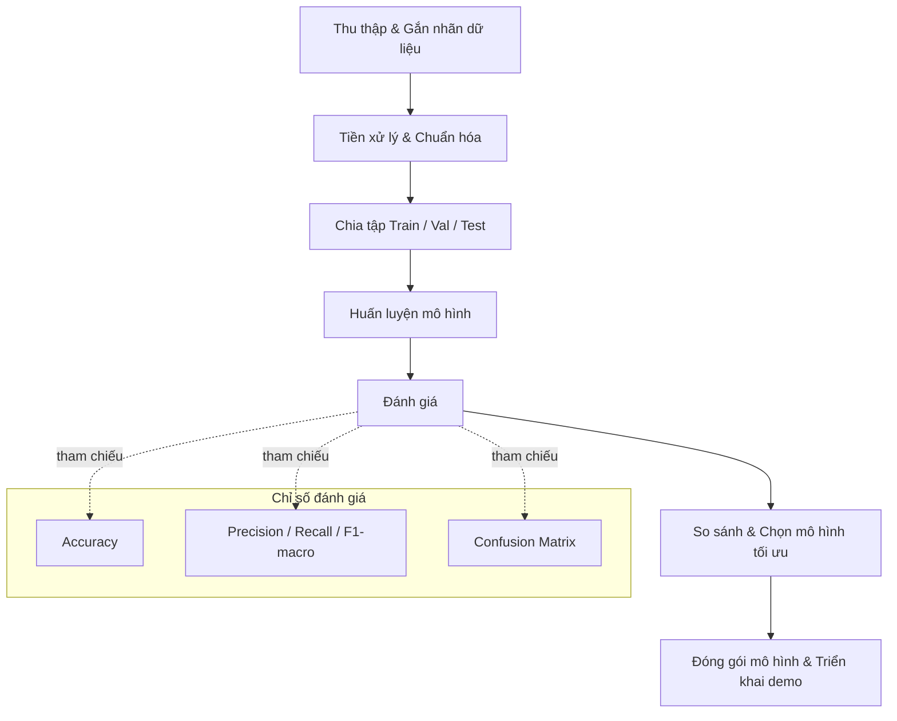

# Danh mục các ký hiệu, chữ viết tắt

- AI: Artificial Intelligence (Trí tuệ nhân tạo)
- ML: Machine Learning (Học máy)
- DL: Deep Learning (Học sâu)
- CNN: Convolutional Neural Network (Mạng nơ-ron tích chập)
- ViT: Vision Transformer
- TPU/GPU/CPU: Bộ xử lý chuyên dụng cho huấn luyện/suy luận
- LR: Learning Rate (Tốc độ học)
- BS: Batch Size (Kích thước lô)
- Epoch: Một vòng duyệt toàn bộ dữ liệu huấn luyện
- CE: Cross-Entropy Loss
- FL: Focal Loss
- WD: Weight Decay (Hệ số suy giảm trọng số)
- SGD/AdamW: Các thuật toán tối ưu
- Acc: Accuracy (Độ chính xác)
- Prec/Rec/F1: Precision/Recall/F1-score
- mF1: Macro F1-score
- CM: Confusion Matrix (Ma trận nhầm lẫn)
- mAP: Mean Average Precision (dùng cho detection)

# Mở đầu

Trong những năm gần đây, cùng với sự phát triển mạnh mẽ của trí tuệ nhân tạo và học sâu (Deep Learning), các hệ thống nhận dạng hình ảnh đã được ứng dụng rộng rãi trong nhiều lĩnh vực đời sống. Trong bối cảnh quản lý rác thải đô thị và công nghiệp, bài toán phân loại rác từ hình ảnh ngày càng nhận được sự quan tâm khi đóng vai trò then chốt giúp giảm chi phí xử lý, tăng tỷ lệ tái chế và hạn chế tác động môi trường. Tuy nhiên, dữ liệu thực tế có nền phức tạp, điều kiện ánh sáng và góc chụp đa dạng, vật thể dễ bị che khuất, đồng thời phân bố lớp thường lệch khiến việc xây dựng một hệ thống tự động vừa chính xác vừa ổn định trở nên thách thức.

Xuất phát từ thực tiễn đó, đề tài “Xây dựng ứng dụng AI trong phân loại rác thải” được thực hiện với mục tiêu phát triển một hệ thống có khả năng tự động phân loại các loại rác phổ biến (hữu cơ, nhựa, giấy, kim loại, thủy tinh, …) từ ảnh. Đề tài tập trung nghiên cứu, huấn luyện và đánh giá các mô hình học sâu hiện đại như ResNet, MobileNet, EfficientNet và Vision Transformer (ViT) trên các bộ dữ liệu công khai như TrashNet, TACO, đồng thời có thể bổ sung dữ liệu thực tế để thu hẹp khoảng cách miền (domain gap). Bên cạnh đó, hệ thống được thiết kế hướng đến khả năng triển khai thực tế, cho phép người dùng tải ảnh lên và nhận kết quả phân loại nhanh chóng, trực quan.

Về phương pháp, đề tài ứng dụng chiến lược học chuyển giao (transfer learning) với mô hình tiền huấn luyện trên ImageNet, kết hợp các kỹ thuật tiền xử lý và tăng cường dữ liệu theo ngữ cảnh (xoay, crop, jitter màu, blur, Cutout/Mixup/CutMix), cùng các biện pháp cân bằng lớp như class weighting hoặc Focal Loss để cải thiện hiệu năng trên dữ liệu lệch lớp. Quá trình huấn luyện sử dụng các lịch học như Cosine hoặc OneCycle, theo dõi các chỉ số Accuracy, Precision/Recall/F1 (macro) và ma trận nhầm lẫn để đánh giá toàn diện. Từ đó, đề tài so sánh các mô hình theo độ chính xác, tốc độ suy luận và kích thước nhằm lựa chọn phương án tối ưu cho triển khai.

Kết quả kỳ vọng của đề tài không chỉ có ý nghĩa học thuật trong việc áp dụng và so sánh các kỹ thuật học sâu cho thị giác máy tính trên dữ liệu rác thải, mà còn mang giá trị thực tiễn khi hỗ trợ quy trình sàng lọc và phân loại rác tại nguồn. Hệ thống demo giúp người dùng và đơn vị vận hành có một công cụ tham khảo, có thể mở rộng tích hợp vào quy trình thực tế, phù hợp với xu thế đô thị thông minh, kinh tế tuần hoàn và chuyển đổi số hiện nay.

# Chương 1: Tổng quan

1.1 Lý do chọn đề tài
Trong bối cảnh lượng rác thải sinh hoạt và công nghiệp gia tăng nhanh chóng theo nhịp độ đô thị hóa, yêu cầu phân loại rác tại nguồn ngày càng trở nên cấp thiết nhằm giảm tải cho hệ thống thu gom và xử lý. Phân loại đúng từ sớm giúp nâng cao chất lượng dòng tái chế, hạn chế tạp chất lẫn vào vật liệu có giá trị và tối ưu chi phí vận hành. Bên cạnh đó, các quy định, tiêu chuẩn về môi trường và kinh tế tuần hoàn cũng thúc đẩy nhu cầu về những giải pháp phân loại chính xác, ổn định và dễ triển khai.

Tuy nhiên, các phương pháp thủ công truyền thống bộc lộ nhiều hạn chế: phụ thuộc vào kinh nghiệm người vận hành, độ nhất quán không cao khi khối lượng công việc lớn, khó duy trì hiệu suất trong thời gian dài và tiềm ẩn nguy cơ an toàn lao động. Trang thiết bị cơ khí – quang học chuyên dụng có ưu thế về năng suất nhưng thiếu linh hoạt khi cần phân biệt các danh mục chi tiết hoặc trong bối cảnh vật thể bị bám bẩn, biến dạng. Sự tiến bộ của trí tuệ nhân tạo, đặc biệt trong thị giác máy tính, mở ra cơ hội xây dựng các hệ thống nhận dạng từ ảnh với độ chính xác cao và khả năng thích nghi tốt, bổ sung hữu hiệu cho các giải pháp hiện có.

1.2 Bối cảnh và vai trò
Dữ liệu hình ảnh rác thải trong môi trường thực có mức độ biến thiên lớn về phông nền, điều kiện chiếu sáng, góc chụp và tỉ lệ vật thể trong khung hình; không ít trường hợp vật thể bị che khuất, móp méo do sử dụng hoặc vận chuyển. Trong bối cảnh đó, hệ thống AI có vai trò chuẩn hóa và tăng tốc quá trình nhận dạng, cung cấp đầu ra tin cậy cho các khâu tiếp theo như tách dòng, tái chế hoặc xử lý cuối. Ở góc độ vận hành, hệ thống có thể hỗ trợ ra quyết định cho người vận hành (decision support) hoặc tự động hóa một phần quy trình tùy theo ràng buộc về an toàn, pháp lý và hạ tầng.

Ngoài ra, một hệ thống nhận dạng hiệu quả còn góp phần nâng cao chất lượng dữ liệu vận hành, tạo điều kiện cho các hoạt động theo dõi chất lượng, tối ưu quy trình và hoạch định năng lực. Dữ liệu thống kê từ hệ thống có thể hỗ trợ báo cáo tuân thủ, đánh giá hiệu quả phân loại tại nguồn và xây dựng các chương trình giáo dục cộng đồng.

1.3 Mục tiêu
Mục tiêu tổng quát của đề tài là phát triển một hệ thống phân loại ảnh rác đa lớp (multi-class) có độ chính xác và độ ổn định đủ để triển khai thử nghiệm trong môi trường thực. Cụ thể, (i) xác lập và mô tả quy trình dữ liệu toàn diện từ thu thập, gắn nhãn đến tiền xử lý; (ii) xây dựng và so sánh các kiến trúc học sâu tiêu biểu; (iii) đề xuất cấu hình huấn luyện, chiến lược tăng cường dữ liệu và biện pháp cân bằng lớp phù hợp; (iv) thiết kế mô-đun suy luận phục vụ trình diễn và kiểm chứng.

Về định lượng, đề tài hướng tới đạt mức F1-score trung bình (macro) mục tiêu trên tập kiểm thử nội bộ, đồng thời đảm bảo thời gian suy luận phù hợp với ngữ cảnh tương tác. Về sản phẩm, đề tài cung cấp mô hình kèm hướng dẫn sử dụng và demo tương tác để minh họa tính khả dụng.

1.4 Phạm vi và giới hạn
Đề tài tập trung vào bài toán phân loại ảnh tĩnh một nhãn/ảnh đối với các nhóm rác phổ biến (hữu cơ, nhựa, giấy, kim loại, thủy tinh…). Các hướng như phát hiện đối tượng, phân đoạn ngữ nghĩa, hoặc nhận diện cấp độ vật liệu chi tiết (ví dụ, các loại nhựa khác nhau) chỉ được đề cập ở mức tổng quan. Nguồn dữ liệu bao gồm các bộ công khai và có thể bổ sung ảnh thực tế nhằm tăng tính đại diện; các giới hạn bao gồm phân bố lớp lệch, quy mô dữ liệu vừa phải, tính không đồng nhất của điều kiện ghi hình và phụ thuộc tài nguyên tính toán trong quá trình huấn luyện.

Về giả định, ảnh đầu vào chứa vật thể mục tiêu với tỉ lệ đủ lớn để nhận dạng; người dùng chụp tương đối rõ nét và không có thao tác xử lý ảnh làm sai lệch nội dung. Những giả định này giúp khoanh vùng phạm vi nghiên cứu và thiết kế giao thức đánh giá phù hợp.

1.5 Phương pháp tiếp cận
Phương pháp tiếp cận dựa trên học chuyển giao với mô hình tiền huấn luyện trên bộ dữ liệu lớn, cho phép tận dụng đặc trưng thị giác tổng quát và rút ngắn thời gian huấn luyện. Giai đoạn tiền xử lý bao gồm chuẩn hóa kích thước, cân bằng lớp ở mức phù hợp và xác lập sơ đồ nhãn thống nhất. Tăng cường dữ liệu được thiết kế theo ngữ cảnh nhằm phản ánh biến thiên thực tế nhưng không làm mất tín hiệu nhận dạng quan trọng.

Chiến lược tinh chỉnh áp dụng theo từng giai đoạn: ban đầu cố định backbone và huấn luyện bộ phân loại, sau đó giải băng dần để tinh chỉnh sâu hơn với tốc độ học giảm. Biện pháp regularization (weight decay, dropout) và lịch học (Cosine, OneCycle) được cân nhắc để cân bằng giữa hội tụ và khả năng tổng quát hóa. Đánh giá sử dụng các thước đo tiêu chuẩn (Accuracy, Precision/Recall/F1-macro) kèm ma trận nhầm lẫn để phân tích sai số theo lớp; khi phù hợp, tiến hành lặp lại thí nghiệm với các hạt giống ngẫu nhiên khác nhau để kiểm tra độ ổn định.

1.6 Quy trình tổng quát
Quy trình tổng quát bao gồm các khâu: (i) thu thập và gắn nhãn dữ liệu theo sơ đồ lớp xác định; (ii) tiền xử lý và chuẩn hóa nhằm đảm bảo tính nhất quán đầu vào; (iii) chia tách tập dữ liệu theo chiến lược giữ tỷ lệ lớp; (iv) huấn luyện với theo dõi chỉ số và điều chỉnh siêu tham số; (v) đánh giá trên tập kiểm thử và phân tích ma trận nhầm lẫn; (vi) so sánh mô hình theo tiêu chí định trước về độ chính xác, độ trễ và kích thước; (vii) đóng gói mô hình, xây dựng mô-đun suy luận và chuẩn bị triển khai trình diễn.


# Chương 2: Cơ sở lý thuyết

2.1 Phân loại rác thải: khái niệm và phân hạng
Rác thải có thể được phân chia theo nhiều tiêu chí khác nhau tùy theo bối cảnh quản lý và mục tiêu xử lý. Phổ biến nhất là phân thành: (i) rác hữu cơ, có khả năng phân hủy sinh học và có thể xử lý bằng ủ sinh học hoặc sản xuất khí sinh học; (ii) rác tái chế như nhựa, kim loại, giấy, thủy tinh, có giá trị vật liệu khi được tách dòng đúng; (iii) rác nguy hại như pin, ắc-quy, hóa chất, sơn, cần quy trình thu gom và xử lý chuyên biệt; (iv) rác điện tử với thành phần phức tạp đòi hỏi tháo dỡ và xử lý riêng; (v) rác cồng kềnh và xây dựng có tính chất cơ học khác biệt; (vi) rác y tế với yêu cầu an toàn sinh học nghiêm ngặt. Sự đa dạng này dẫn tới yêu cầu nhận dạng linh hoạt, có khả năng phân biệt theo nhiều tiêu chí, đồng thời cân nhắc yếu tố an toàn và pháp lý.

2.2 Phương pháp truyền thống trong phân loại rác
Các hệ thống truyền thống dựa trên cơ khí – vật lý (sàng lọc theo kích thước, phân loại theo khối lượng riêng, nam châm và dòng Foucault để tách kim loại) và quang học (cảm biến phổ cận hồng ngoại, X-ray) được sử dụng rộng rãi tại các cơ sở phân loại vật liệu (MRF). Các công nghệ này có ưu điểm về năng suất, độ bền công nghiệp và khả năng xử lý lưu lượng lớn. Tuy vậy, chúng gặp khó khăn khi phân biệt các vật thể có hình dạng tương tự, bị bám bẩn hoặc biến dạng, và khi yêu cầu phân loại ở mức danh mục tinh (ví dụ nhiều loại nhựa khác nhau). Do đó, việc kết hợp với nhận dạng dựa trên thị giác máy tính từ ảnh RGB có thể bổ sung thông tin ngữ cảnh và hình thái, nâng cao độ chính xác ở các khâu cần phân biệt chi tiết.

2.3 Thách thức của nhận dạng hình ảnh rác thải
Nhận dạng từ ảnh trong bối cảnh rác thải gặp nhiều thách thức: (i) biến thiên ngoại cảnh (ánh sáng, góc chụp, phông nền phức tạp); (ii) biến dạng và che khuất do sử dụng, vận chuyển hoặc nghiền nát; (iii) nhiễu nhãn và thiếu nhất quán trong quá trình gắn nhãn thủ công; (iv) mất cân bằng phân bố lớp; (v) sai lệch miền giữa dữ liệu huấn luyện và dữ liệu triển khai. Bài toán có thể ở dạng đa lớp (mỗi ảnh một nhãn) hoặc đa nhãn (ảnh có nhiều vật thể), kéo theo yêu cầu lựa chọn kiến trúc mô hình, hàm mất mát và giao thức đánh giá phù hợp.

2.4 Nền tảng học máy và học sâu trong phân loại rác
Các tiếp cận học máy truyền thống dựa trên trích xuất đặc trưng thủ công (SIFT, HOG) kết hợp với các bộ phân loại như SVM, Random Forest hoặc Logistic Regression có ưu điểm về khả năng diễn giải nhưng thiếu tính thích nghi ở bối cảnh đa dạng. Học sâu, đặc biệt là CNN, học đặc trưng phân cấp trực tiếp từ dữ liệu thông qua tích chập, cho phép mô hình hóa hình dạng, kết cấu và ngữ cảnh. Các kiến trúc Transformer cho thị giác (ViT, Swin) sử dụng cơ chế tự chú ý để học quan hệ dài hạn giữa các vùng ảnh, mang lại hiệu quả cao khi dữ liệu đủ lớn hoặc khi có chiến lược regularization phù hợp. Học chuyển giao với mô hình tiền huấn luyện trên ImageNet giúp cải thiện hiệu năng khi dữ liệu đặc thù hạn chế. Các kỹ thuật regularization và tăng cường dữ liệu (dropout, weight decay, label smoothing, Cutout, Mixup, CutMix) đóng vai trò quan trọng trong việc giảm overfitting và tăng khả năng tổng quát hóa.

2.5 Thước đo đánh giá
Độ chính xác (Accuracy) phản ánh tỉ lệ dự đoán đúng tổng thể nhưng có thể gây hiểu lầm trong bối cảnh mất cân bằng lớp. Vì vậy, các chỉ số Precision, Recall và F1-score theo trung bình macro được ưu tiên nhằm xem xét cân bằng giữa các lớp. Ma trận nhầm lẫn hỗ trợ phân tích chi tiết các cặp lớp dễ nhầm. Với thiết lập đa nhãn, các thước đo như AUC-ROC và mAP cho biết hiệu năng tổng quát hơn trên nhiều ngưỡng quyết định. Trong đánh giá hệ thống, cần lưu ý đến tính ổn định theo nhiều phép chia dữ liệu và xem xét hiệu năng trong các điều kiện gần với triển khai thực tế.

2.6 So sánh tổng quan
Tổng quan cho thấy phương pháp cơ khí – quang học truyền thống phù hợp cho phân tách vật liệu quy mô lớn với yêu cầu vận hành khắt khe, trong khi học sâu từ ảnh mang lại tính linh hoạt và khả năng phân biệt tinh hơn giữa các lớp nhưng phụ thuộc nhiều vào chất lượng dữ liệu và tài nguyên tính toán. Sự phối hợp giữa hai hướng tiếp cận—kết hợp cảm biến quang học/ cơ khí để tiền xử lý và hệ thống thị giác dựa trên học sâu để quyết định—có thể tối ưu hóa hiệu quả tổng thể của dây chuyền phân loại hiện đại.

2.7 Lưu đồ tổng quát (Flowchart)
Lưu đồ sau phác thảo quy trình tổng quát của hệ thống phân loại rác dựa trên học sâu:

```
[Thu thập & Gắn nhãn dữ liệu]
                |
                v
[Tiền xử lý & Chuẩn hóa] --(Kiểm tra chất lượng, cân bằng lớp)--> [Dữ liệu sạch]
                |
                v
[Chia tập Train/Val/Test] --(giữ tỉ lệ lớp)--> [Tập Train] [Tập Val] [Tập Test]
                |
                v
[Huấn luyện mô hình]
  (Transfer learning, augmentation, tối ưu siêu tham số)
                |
                v
[Đánh giá]
  (Accuracy, Precision, Recall, F1-macro, Confusion Matrix)
                |
                v
[So sánh mô hình & Lựa chọn cấu hình tối ưu]
                |
                v
[Đóng gói mô hình & Triển khai demo]
```

Sơ đồ Mermaid (tùy chọn, dùng khi xuất HTML/PDF hỗ trợ Mermaid):



2.8 Thước đo đánh giá: công thức tính toán
Ký hiệu cho một lớp bất kỳ (trong đa lớp, tính riêng cho từng lớp k):
- TP (True Positive): dự đoán đúng dương
- TN (True Negative): dự đoán đúng âm
- FP (False Positive): dự đoán dương nhưng sai
- FN (False Negative): dự đoán âm nhưng sai

Các công thức cơ bản:
- Accuracy = (TP + TN) / (TP + TN + FP + FN)
- Precision = TP / (TP + FP)
- Recall = TP / (TP + FN)
- F1-score = 2 × Precision × Recall / (Precision + Recall)
  (tương đương F1 = 2TP / (2TP + FP + FN) khi thay thế)

Trung bình theo lớp cho đa lớp (K lớp):
- Macro-Precision = (1/K) × Σ_k Precision_k
- Macro-Recall    = (1/K) × Σ_k Recall_k
- Macro-F1        = (1/K) × Σ_k F1_k

Gộp toàn bộ mẫu (micro):
- Micro-Precision = (Σ_k TP_k) / (Σ_k TP_k + Σ_k FP_k)
- Micro-Recall    = (Σ_k TP_k) / (Σ_k TP_k + Σ_k FN_k)
- Micro-F1        = 2 × Micro-P × Micro-R / (Micro-P + Micro-R)

Ma trận nhầm lẫn (Confusion Matrix) cho K lớp:
- Phần tử C[i,j] là số mẫu có nhãn thật i nhưng bị dự đoán thành j.
- Phân tích các hàng/cột giúp nhận diện cặp lớp dễ nhầm và điều chỉnh chiến lược augmentation/tiền xử lý.

Gợi ý bổ sung (khi phù hợp bài toán):
- Top-k Accuracy: tỉ lệ mẫu mà nhãn đúng nằm trong k dự đoán có xác suất cao nhất.
- Đa nhãn: dùng AUC-ROC, mAP theo từng nhãn và trung bình; ngưỡng quyết định sigmoid có thể tinh chỉnh theo lớp.

# Chương 3: Dữ liệu và kiến trúc mô hình

3.1 Các bộ dữ liệu công khai cho phân loại rác
Các bộ dữ liệu thường được sử dụng gồm TrashNet và TACO. TrashNet cung cấp ảnh của một số lớp rác cơ bản được chụp trong điều kiện tương đối kiểm soát, thuận lợi cho việc khởi tạo mô hình nền. TACO là tập dữ liệu ảnh rác trong môi trường thực với mức đa dạng cao về bối cảnh, có nhiều loại vật thể và mức độ bẩn/hao mòn khác nhau. Khi sử dụng các bộ dữ liệu này, cần quan tâm đến sơ đồ nhãn và mức tương thích giữa các bộ; hiện tượng mất cân bằng lớp; chất lượng và tính nhất quán của nhãn; cũng như giấy phép sử dụng và phân phối lại.

3.2 Đặc điểm dữ liệu và các xem xét tiền xử lý
Ảnh rác thải có sự biến thiên lớn về kích thước, tỉ lệ vật thể trong khung hình và điều kiện ghi hình (ánh sáng, phông nền). Do vậy, các bước tiền xử lý thường bao gồm chuẩn hóa kích thước đầu vào, cân bằng lớp ở mức phù hợp, phát hiện và loại bỏ mẫu nhiễu/nhãn sai, cùng với điều chỉnh thống nhất sơ đồ nhãn khi hợp nhất nhiều nguồn dữ liệu. Tăng cường dữ liệu (xoay, lật, thay đổi màu sắc, làm mờ có kiểm soát, cắt–dán như Mixup/CutMix) được cân nhắc để cải thiện khả năng tổng quát hóa, đồng thời tránh làm biến mất các tín hiệu nhận dạng quan trọng.

3.3 Kiến trúc mô hình dựa trên CNN
Các mạng CNN là lựa chọn phổ biến do hiệu quả và tính chín muồi. ResNet sử dụng kết nối tắt (skip connection) để ổn định gradient cho các mạng sâu. EfficientNet áp dụng chiến lược co–giãn hợp thành (compound scaling) nhằm cân bằng chiều sâu, chiều rộng và độ phân giải, đạt hiệu quả tham số tốt. MobileNet tận dụng tích chập tách chiều sâu (depthwise separable convolution) và các khối bottleneck để giảm số phép tính, phù hợp với thiết bị biên. Các biến thể hiện đại như ConvNeXt tiếp tục tối ưu hóa thiết kế CNN theo hướng đơn giản và hiệu quả.

3.4 Kiến trúc mô hình dựa trên Transformer
Các kiến trúc Transformer trong thị giác, tiêu biểu là Vision Transformer (ViT) và Swin Transformer, mô hình hóa quan hệ dài hạn giữa các vùng ảnh thông qua cơ chế tự chú ý. Khi dữ liệu đủ lớn hoặc có chiến lược regularization phù hợp, Transformer đạt hiệu quả cạnh tranh, đặc biệt ở các danh mục phức tạp. Việc lựa chọn giữa CNN và Transformer phụ thuộc cân nhắc giữa độ chính xác mong muốn, tài nguyên tính toán và yêu cầu độ trễ khi triển khai.

3.5 Phát hiện đối tượng và phân loại theo vùng (khi cần)
Trong bối cảnh ảnh chứa nhiều vật thể nhỏ hoặc nền phức tạp, có thể áp dụng hướng “phân loại qua phát hiện”, sử dụng các mô hình như YOLO, Faster R-CNN hoặc DETR để trích xuất vùng vật thể trước khi phân loại. Cách tiếp cận này tăng chi phí tính toán nhưng giúp cải thiện độ chính xác trong các tình huống đa vật thể, đặc biệt khi vật thể nhỏ chiếm tỉ lệ thấp trong khung hình.

3.6 Chiến lược học chuyển giao và tinh chỉnh
Học chuyển giao với mô hình tiền huấn luyện trên tập dữ liệu lớn (ví dụ ImageNet) là chiến lược hiệu quả khi dữ liệu chuyên biệt hạn chế. Các phương án thường gặp gồm cố định phần trích xuất đặc trưng và huấn luyện bộ phân loại, sau đó giải băng dần các tầng sâu; hoặc tinh chỉnh toàn bộ mô hình với tốc độ học phân cấp theo tầng. Việc lựa chọn lịch học, biện pháp regularization (weight decay, dropout) và kỹ thuật huấn luyện (mixed precision, gradient clipping) có ảnh hưởng đáng kể đến khả năng tổng quát hóa và độ ổn định.

3.7 Tiêu chí lựa chọn mô hình cho triển khai
Lựa chọn kiến trúc phụ thuộc mục tiêu sử dụng: nếu ưu tiên độ chính xác, có thể cân nhắc các mô hình sâu hơn như EfficientNet hoặc Transformer; nếu ưu tiên độ trễ và tài nguyên, các biến thể nhẹ như MobileNet hoặc ResNet gọn là ứng viên phù hợp. Các yếu tố như kích thước mô hình, mức sử dụng bộ nhớ, thông lượng suy luận và khả năng tối ưu hóa (lượng tử hóa, tỉa mô hình) cần được đánh giá song song với chất lượng dự đoán để đảm bảo tính khả thi khi đưa vào ứng dụng.

---
Tài liệu liên quan trong repo: `docs/03_training_workflow.md:1`, `README.md:1`, `requirements.txt:1`.
